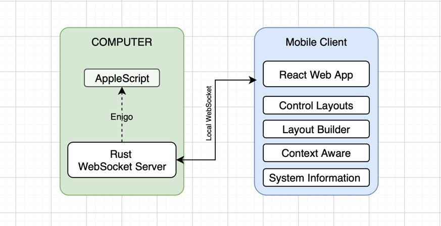

# ⚡ cmdRelay
A high-performance, context-aware PC controller that turns your mobile device into a smart macro pad

### quick idea
- cmdRelay basically helps you control your PC with your mobile device.
- But in a unique way not like any other remote controller
- **Read below to know how it's unique and more useful from the existing solutions**

## 1. High Performance
- Built on a custom Rust WebSocket server - Blazing Fast low level access
- control commands execute over your local network -  latency under 5ms

## 2. Context Aware Layouts
- The Rust server actively scans the host OS for tracking the the active window. 
- if you switch from your browser to your code editor then layout on your mobile automatically updates to match your target app.

## 3. System Telemetry Dashboard
- Live streaming of CPU usage, RAM consumption, and top memory-hogging processes. 
- Uses a smart subscription architecture to ensure zero battery or CPU waste when the dashboard is not used.

## 4. OS App Launcher 
- Automatically scans your host machine for installed applications
- allowing you to launch software directly from your mobile device.

## 5. Multi-Threaded Macro Engine 
- Safely handles complex, concurrent key combinations and macro executions without blocking the main server thread.

# Installation & Usage
## MacOs
- [Latest Releases](https://github.com/ashish757/cmdRelay/releases)
- `Apple Silicon` Download the aarch64.dmg file.
- `Intel Macs` Download the x86_64.dmg file.

### Because the app isn't signed with an Apple Developer certificate yet, macOS will prevent you from opening it normally. To bypass this:
1. Try opening the application once (it will fail, but still do open)
2. Open System Settings, in sidebar look for `Privacy & Secuity` Option.
3. Scroll down and under `Security`, there you will see option to open the App anyway
- After this install the program and run it, you will the app icon in the `Menu Bar`. Then you can click on the `Show QR Code option` to connect you mobile.

## Windows
1. Download the correct package for you system from [Latest Releases](https://github.com/ashish757/cmdRelay/releases).
2. Try to run the application,
3. but since this is a new, unsigned application, Windows Defender might block it. Click `More info` and then `Run anyway`
- Once installed launch cmdRelay from your Start menu. The app will minimize to your system tray—click the tray icon to view and connect mobile with `QR code`.

## Linux
- I dont think i need to tell you guys anything, just get the correct binary from the [Latest Releases](https://github.com/ashish757/cmdRelay/releases) and then you know it better then me

# 🛠️ Tech Stack
### Backend (App on computer)
- **`Rust`** core server and hardware interfacing.
- **`Tokio & Axum`** Asynchronous runtime and robust WebSocket/HTTP routing.
- **`Tauri`** Lightweight system tray integration and cross-platform native compilation.
- **`Sysinfo & Enigo`** Hardware telemetry extraction and OS-level keyboard/mouse simulation.

### Frontend (Mobile Client)

- **`React & TypeScript`** strictly typed, component-driven UI.
- **`Tailwind CSS`** utility-first styling for a fluid mobile experience.
- **`Lucide-react`** for SVG icons

## AI use
- Used JetBrain's RustRover's Auto inline code completion
- Took AI help in creation of `UI` elements, especially the control layout builder `canvas`
- I am fairly new in Rust and `low level` coding (coming from `web development`), took AI code help from `Gemini` in implementation of `Threading`