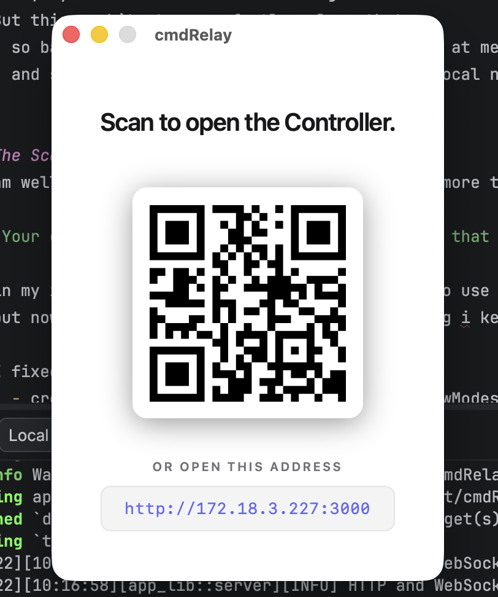
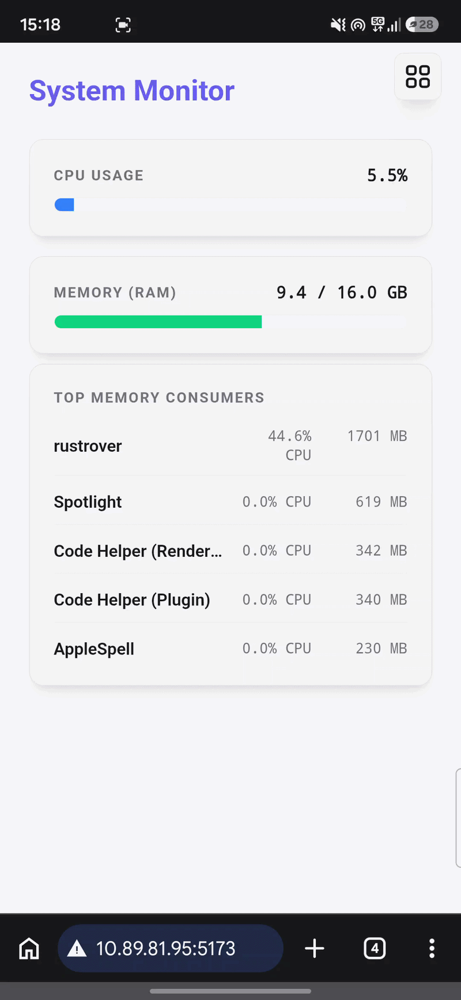
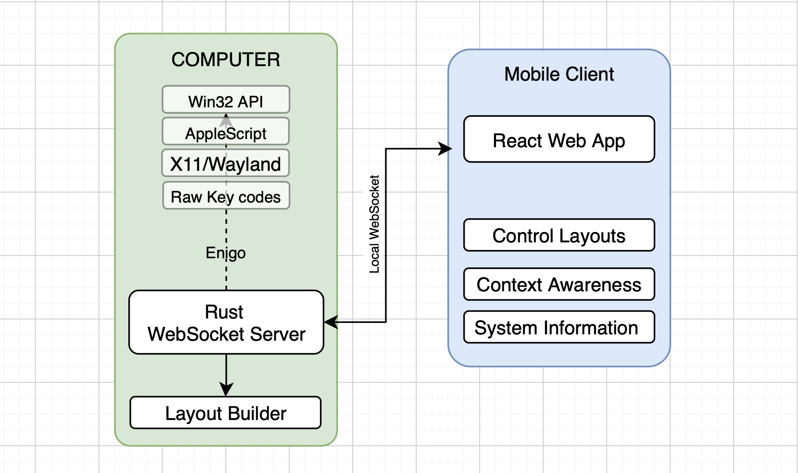

# ⚡ cmdRelay
A high-performance, context-aware PC controller that turns your mobile device into a smart macro pad


<table>
  <tr>
    <td>
      
    </td>
    <td>
      
    </td>
  </tr>
</table>

## Table of Contents
* [Features](#Features)
* [Usage](#usage)
* [Installation](#installation)
* [Credits](#credits)
* [Demo Video](#demo-video)

### quick idea
- cmdRelay basically helps you control your PC with your mobile device.
- But in a unique way not like any other remote controller
- **Read below to know how it's unique and more useful from the existing solutions**




# Features
## 1. High Performance
- Built on a custom Rust WebSocket server - Blazing Fast low level access
- control commands execute over your local network -  latency under 5ms


## 2. Context Aware Layouts
- The Rust server actively scans the host OS for tracking the the active window. 
- if you switch from your browser to your code editor then layout on your mobile automatically updates to match your target app.


## 3. System Telemetry Dashboard
- Live streaming of CPU usage, RAM consumption, and top memory-hogging processes. 
- Uses a smart subscription architecture to ensure zero battery or CPU waste when the dashboard is not used.

## 4. OS App Launcher 
- Automatically scans your host machine for installed applications
- allowing you to launch software directly from your mobile device.

## 5. Multi-Threaded Macro Engine 
- Safely handles complex, concurrent key combinations and macro executions without blocking the main server thread.


## Installation & Usage

# usage

> There are some bugs on the windows and Linux version, as i only have acces to mac machine, i could not test the application on the other platform
Please Watch the `Demo video` (link presenet at the bottom) to get to know about the application, if you could not run it

### **when using this application, make sure your mobile device and your computer are on same local network, that is connected with same Wi-Fi**

### This application requires a lot of `system` & `network` permission, if you are not willing to give such permissions then you may just watch the video demo below to `evaluate`, but i will requirest you to try to run the application on your system for best experience.

### Network Issues
- Sometimes Router or computer settings can block the communication over the websocket, in that case you are requested to use your own mobile hotspot and connect with the computer to test the application.
- Windows Firewall issue
   1. Simply search google for "how to allow app to connect over private network in windows"
- If Router's `Client Isolation` Setting is turned on
- If this setting is on, you need to connect with your personal hotspot

# Installation
## MacOs
- [Latest Releases](https://github.com/ashish757/cmdRelay/releases)
- `Apple Silicon` Download the aarch64.dmg file.
- `Intel Macs` Download the x86_64.dmg file.

1. Click and install the application normally

### Because the app isn't signed with an Apple Developer certificate yet, macOS will prevent you from opening it normally
2. after this when you will try to open the application, you will see errors and it won't open
    - this is because this application is from an unknown developer, which is blocked by Apple's gatekeeper by default
    - you may not face this problem, if you have an intel chip,  
    - but modern Apple silicon chips, M series have more security
3. run the below command in terminal and enter password
```bash
sudo xattr -cr /Applications/cmdRelay.app
```
4. After this command, you would be able to run the application, look for app icon the top menu bar
   (this completely safe command, this commands simply tells that your computer that you trust the application)

> If you still could not run this application on your Apple silicon chips then Download the Intel version and install it. it will be able to run without any concern because intel chips allowed running unsigned applications. Keep in mind that you must have rosetta downloaded on your system.

> Please Watch the `Demo video` (link presenet at the bottom) to get to know about the application, if you could not run it


## Windows
1. Download the correct package for you system from [Latest Releases](https://github.com/ashish757/cmdRelay/releases).
2. Try to run the application,
3. but since this is a new, unsigned application, Windows Defender might block it. Click `More info` and then `Run anyway`
- Once installed launch cmdRelay from your Start menu. The app will minimize to your system tray—click the tray icon to view and connect mobile with `QR code`.

- If you are facing any connectivity issues
- Simply search google for "how to allow app to connect over privte network in windows"

> Please Watch the `Demo video` (link presenet at the bottom) to get to know about the application, if you could not run it


## Linux
- I dont think i need to tell you guys anything, just get the correct binary from the [Latest Releases](https://github.com/ashish757/cmdRelay/releases) and then you know it better then me

> Please Watch the `Demo video` (link presenet at the bottom) to get to know about the application, if you could not run it

# 🛠️ Tech Stack
### Backend (App on computer)
- **`Rust`** core server and hardware interfacing.
- **`Tokio & Axum`** Asynchronous runtime and robust WebSocket/HTTP routing.
- **`Tauri`** Lightweight system tray integration and cross-platform native compilation.
- **`Sysinfo & Enigo`** Hardware telemetry extraction and OS-level keyboard/mouse simulation.

### Frontend (Mobile Client)

- **`React & TypeScript`** strictly typed, component-driven UI.
- **`Tailwind CSS`** utility-first styling for a fluid mobile experience.
- **`Lucide-react`** for SVG icons

## Credits
- Used SVG icons from https://simpleicons.org for app logos.

## AI use
- Used JetBrain's RustRover's Auto inline code completion
- Took AI help in creation of `UI` elements, especially the control layout builder `canvas`
- I am fairly new in Rust and `low level` coding (coming from `web development`), took AI code help from `Gemini` in implementation of `Threading`

# Demo Video


https://github.com/user-attachments/assets/6da8a9b3-adca-49f0-8552-399b4c0bd15f


